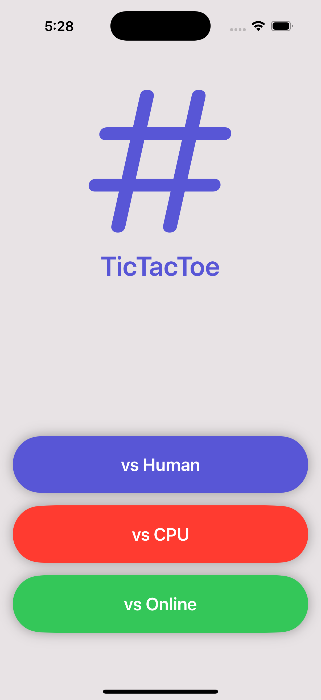
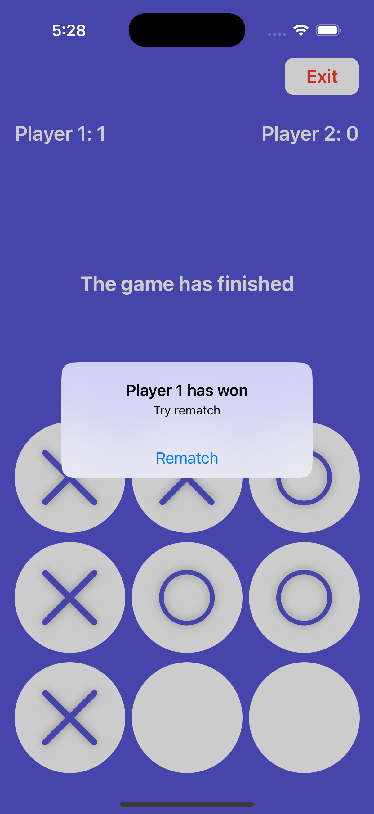

# TicTacToe App

TicTacToe game with 3 modes (vs human, vs CPU and online).

### Setup
This project was implemented using XCode 16 and iOS 18 deployment target.

## Summary

#### - ADVANCED APP DESIGN
The main goal to develop this simple app is demostrate the use of  SwifUI, Combine, Firebase and Storage using  MVVM architecture to implement this solution.

#### - SWIFTUI USE
We implemented the logic game using a lot features of SwiftUI language.

#### - Firebase Store
We save all data for online mode into Firebase store and we use it to sync the game between 2 devices..

# App screens

<table style="width:100%">
  <tr>
    <td></th>
    <td></th>
  </tr>
</table>

### End